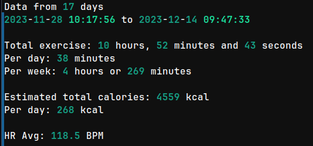

# Tools to calculate exercise data

Can download your synced activities from Garmin Connect. Shows total hours exercised, as well as per day and per week, calorie estimates, and logged heart rate average.




## Requirements

- [Python](https://www.python.org/downloads/) (probably 3.9+)
- [Poetry](https://python-poetry.org/docs/#installation)


## Initial data download

Because the updates downloaded from Garmin don't contain the full history, only recent entries, you need to download the initial data yourself.

Log into [Garmin Connect](https://connect.garmin.com/modern/) and the [activities](https://connect.garmin.com/modern/activities) -section. Make sure you make your screen wide enough to render the `Export` and `Import` links at the top right corner of the page. Scroll to the bottom of the page until it stops loading data you care about, then go back to the top and click `Export CSV`. Save the `Activities.csv` file in the folder where you checked out the code as a base.


## Configuration and preparation

Create a `.env` file in the same folder with the `Activities.csv`, and store in it the contents:

```
GARMIN_USERNAME=your.garmin.connect@email.com
GARMIN_PASSWORD=your.garmin.connect.P455w0rd!
```

Then run

```shell
poetry install
poetry run playwright install
```

## Usage

Run:

```shell
./download_and_calculate.sh
```

On Windows you would likely have to manually run the 3 commands instead:

```shell
poetry run download-garmin-activities
poetry run merge-activities
poetry run calculate-total
```

You can of course use the above commands as you wish, the names should be fairly self-explanatory.


# Financial support

This project has been made possible thanks to [Cocreators](https://cocreators.ee) and [Lietu](https://lietu.net). You
can help us continue our open source work by supporting us on [Buy me a coffee](https://www.buymeacoffee.com/cocreators)
.

[](https://www.buymeacoffee.com/cocreators)


## Licensing

[BSD 3-clause](./LICENSE)
